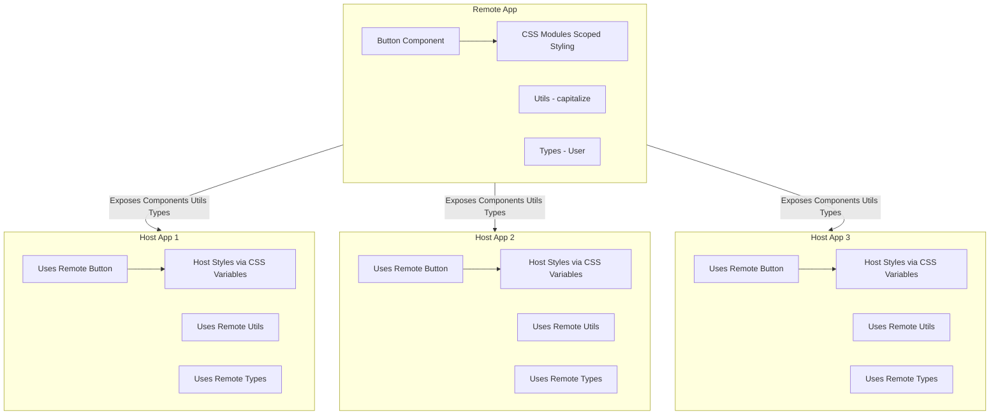

# Module Federation Architecture

```mermaid
%%{init: {
  'theme': 'default',
  'themeVariables': { 'fontSize': '16px'},
  'flowchart': {
    'htmlLabels': true,
    'curve': 'cardinal'
  },
  'sequence': {
    'useMaxWidth': false,
    'width': 3000,
    'height': 2000,
    'diagramPadding': 8
  },
  'zoom': {
    'enabled': true,
    'controls': true
  }
}}%%
graph TD
    subgraph RemoteApp[Remote App]
        A1[Button Component]
        A2[Utils - capitalize]
        A3[Types - User]
        A4[CSS Modules Scoped Styling]
        A1 --> A4
    end

    subgraph HostApp1[Host App 1]
        B1[Uses Remote Button]
        B2[Uses Remote Utils]
        B3[Uses Remote Types]
        B4[Host Styles via CSS Variables]
        B1 --> B4
    end

    subgraph HostApp2[Host App 2]
        C1[Uses Remote Button]
        C2[Uses Remote Utils]
        C3[Uses Remote Types]
        C4[Host Styles via CSS Variables]
        C1 --> C4
    end

    subgraph HostApp3[Host App 3]
        D1[Uses Remote Button]
        D2[Uses Remote Utils]
        D3[Uses Remote Types]
        D4[Host Styles via CSS Variables]
        D1 --> D4
    end

    RemoteApp -->|Exposes Components Utils Types| HostApp1
    RemoteApp -->|Exposes Components Utils Types| HostApp2
    RemoteApp -->|Exposes Components Utils Types| HostApp3

```
